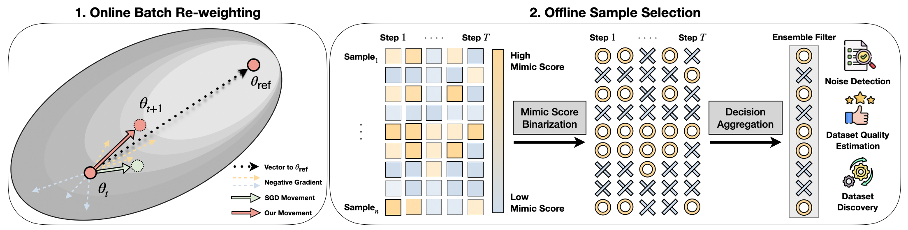
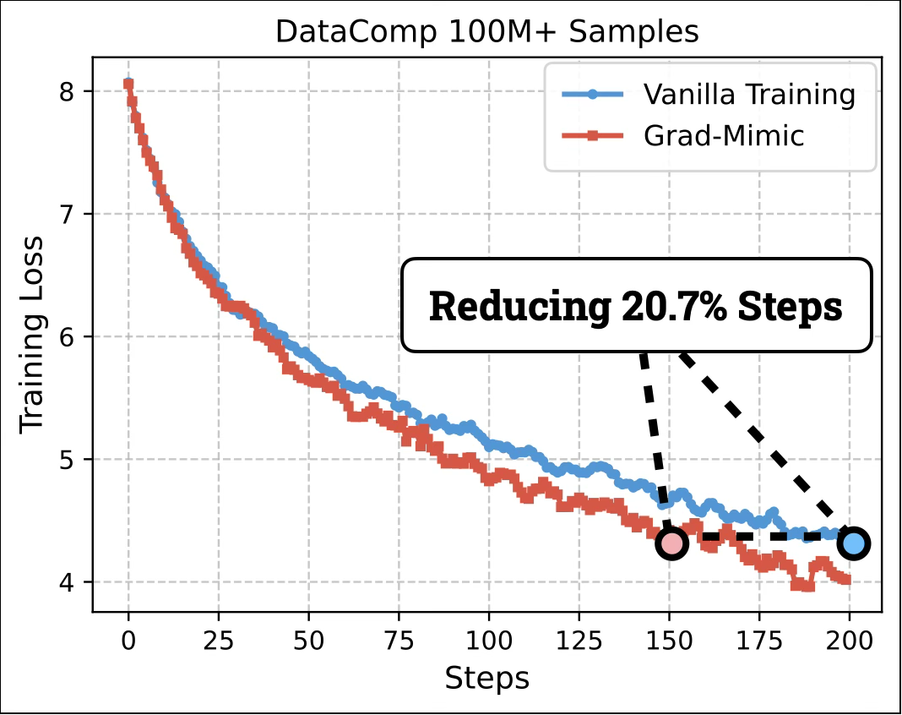
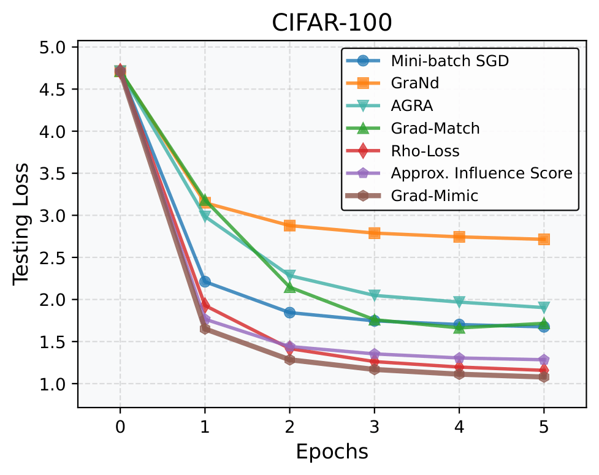

# Evaluating Sample Utility for Data Selection by Mimicking Model Weights (ICML'26)

Official implementation of **Grad-Mimic**, a new batch-reweighting algorithm using weight-space geometry to explore sample utility and data selection.

Grad-Mimic aligns per-sample gradients with a *task vector*---the weight difference between a clean reference model and the current model---to up-weight informative samples and suppress the influence of mislabeled ones.

> **ArXiv Page:** [arXiv 2501.06708](https://arxiv.org/abs/2501.06708)



---

## Overview


| Mode                 | Description                                                                                            |
| -------------------- | ------------------------------------------------------------------------------------------------------ |
| `grad-descent`       | Standard gradient descent baseline. Run this first to produce a reference model.                       |
| `grad-mimic`         | **Our method.** Reweights gradients using task-vector similarity. Requires a reference model.          |
| `influence-function` | Variant that uses a small set of clean samples instead of using induced vector from a reference model. |
| `grad-norm`          | Baseline: up-weights samples by gradient norm.                                                         |
| `agra`               | Competitor: aligns gradients with a held-out batch.                                                    |
| `grad-match`         | Competitor: solves a convex subset-selection problem (requires MOSEK).                                 |
| `rho`                | Competitor: reweights by excess loss over the reference model.                                         |


The mimic score captures meaningful sample quality — top-scoring samples are semantically coherent, while low-scoring ones tend to be noisy or ambiguous:


---

## Key Results

On DataComp 100M+, Grad-Mimic reaches the same training loss **20.7% faster** than vanilla training:



Grad-Mimic consistently achieves lower testing loss across epochs compared to baselines:



---

## Environment Setup

```bash
conda create -n grad-mimic python=3.10
conda activate grad-mimic
pip install -r requirements.txt
```

`grad-match` and `grad-mimic --method opt` additionally require [MOSEK](https://www.mosek.com/products/academic-licenses/) (free academic license) installed alongside `cvxpy`.

---

## Used Data

### Automatic download

```bash
# Download all supported datasets
python scripts/download_data.py --data_dir ./data

# Download a subset
python scripts/download_data.py --data_dir ./data --datasets cifar10 cifar100 dtd
```

Supported datasets: `cifar10`, `cifar100`, `dtd`, `stl10`, `flower102`, `pet`.

All data will be placed under `./data/` by default. Pass `--dataset_dir <path>` to `run.py` if you store data elsewhere.

---

## Usage

### Step 1 — Train a reference model (clean, no noise)

```bash
python run.py \
    --mode grad-descent \
    --dataset_name cifar10 \
    --noisy_level 0.0 \
    --model_arch vit-b \
    --num_epoch 5 \
    --seed 123
```

The trained model is saved to `outputs/models/pretrained_linear_probing/` and will be picked up automatically in Step 2.

### Step 2 — Run Grad-Mimic with label noise

```bash
python run.py \
    --mode grad-mimic \
    --dataset_name cifar10 \
    --noisy_level 0.3 \
    --model_arch vit-b \
    --method normed_proj \
    --num_epoch 5 \
    --seed 42 \
    --target_seed 123
```

### Run a baseline

```bash
python run.py --mode grad-norm --dataset_name cifar100 --noisy_level 0.4 --num_epoch 5
python run.py --mode agra     --dataset_name dtd       --noisy_level 0.2 --num_epoch 10
```

### All arguments

```
python run.py --help
```

Key arguments:


| Argument                                   | Default              | Description                                                           |
| ------------------------------------------ | -------------------- | --------------------------------------------------------------------- |
| `--mode`                                   | —                    | Training algorithm (required).                                        |
| `--dataset_name`                           | `cifar10`            | Dataset: `cifar10`, `cifar100`, `dtd`, `stl10`, `flower102`, `pet`.   |
| `--noisy_level`                            | `0.0, 0.1, 0.2, ...` | Label noise fraction (0–1).                                           |
| `--model_arch`                             | `vit-b`              | Backbone: `vit-b` or `vit-l`.                                         |
| `--pretrained` / `--no-pretrained`         | `True`               | Use ImageNet-pretrained weights.                                      |
| `--linear_probing` / `--no-linear_probing` | `True`               | Fine-tune head only vs. full model.                                   |
| `--mimic_layer`                            | `heads.head.weight`  | Layer used for gradient matching.                                     |
| `--method`                                 | `normed_proj`        | Similarity metric: `cos`, `proj`, `normed_cos`, `normed_proj`, `opt`. |
| `--temperature`                            | `1.0`                | Softmax temperature for `normed_*` methods.                           |
| `--starting_epoch`                         | `0`                  | Epoch from which the chosen algorithm activates.                      |
| `--few_shot`                               | `10`                 | Clean samples per class used by `influence-function` mode.            |
| `--top_p`                                  | `1.0`                | Fraction of training data to keep.                                    |
| `--sampling_method`                        | `random`             | Subset selection: `random` or `mimic`.                                |
| `--dataset_dir`                            | `./data`             | Root directory of datasets.                                           |
| `--output_dir`                             | `./outputs`          | Root directory for logs and saved models.                             |
| `--ref_model`                              | `None`               | Explicit path to reference model `.pt` file.                          |
| `--seed`                                   | `123`                | Global random seed.                                                   |
| `--target_seed`                            | `123`                | Seed of the reference model to locate automatically.                  |


---

## Citation

```bibtex
@inproceedings{
    huang2026evaluating,
    title={Evaluating Sample Utility for Efficient Data Selection by Mimicking Model Weights},
    author={Tzu-Heng Huang and Manjot Bilkhu and John Cooper and Frederic Sala and Javier Movellan},
    booktitle={Forty-third International Conference on Machine Learning},
    year={2026},
    url={https://openreview.net/forum?id=EX97eHYHIT}
}
```
